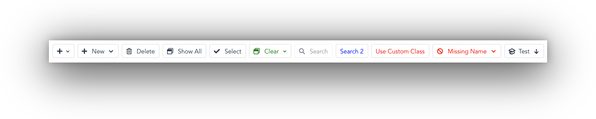
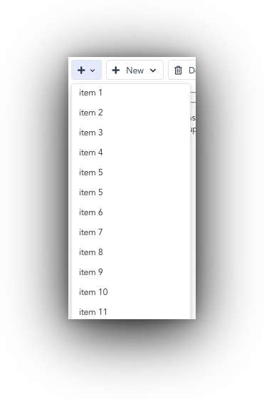
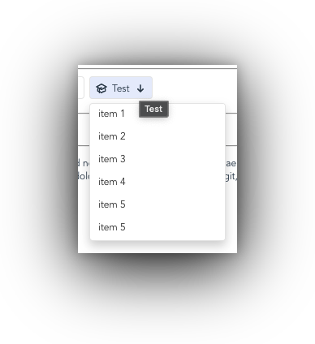

# vue-toolbar-button

## Description

<h1 align="center">
    
</h1>

VueToolbarButton provides a clean button component which may include an icon and/or down arrow with built-in dropdown menu. Using the simple slot interface, you can choose to supply markup for a fontawesome aware icon prop, or using the simple slot interface, you can provide your own icons such as `svg` images. In addition, VueToolbarButton can be configured to show a down arrow, again using the built-in prop, or any other markup you wish to display in the `arrow` slot

## Installation

Using `npm`

```bash
npm i @codedungeon/vue-toolbar-button
```

Using `yarn`

```bash
yarn @codedungeon/vue-toolbar-button
```

## Usage

VueToolbarButton provides a series of `props` which control how the buttons are created (see prop list below)

### Standard Buttons

The following examples outline the general interface for creating buttons. You can use the `icon` prop to provide a standard fontawesome icon

```html
<!-- displays button with plus icon and down arrow, no slot value so no button text -->
<vue-toolbar-button @click="onToolbar('show popup')" icon="far fa-plus" :down-arrow="true" arrow-size="mini"></vue-toolbar-button>
```

The following examples outline the general interface for creating buttons. You can use the `icon` prop to provide a standard fontawesome icon

```html
<!-- displays button with plus icon, button text of `New` and down arrow in default (normal) statue -->
<vue-toolbar-button name="new" @click="onToolbar" icon="far fa-plus" :down-arrow="true">
    New
</vue-toolbar-button>
```

The following examples creates a standard button without an `icon`, or `downArrow`, providing a standard button using custom `style`

```html
<!-- displays button with no icon, button text and down arrow; in addition custom class has been applied -->
<vue-toolbar-button name="search" style="color: red;" @click="onToolbar">
    Use Custom Class
</vue-toolbar-button>
```

### Dropdown Only

For example, the following demonstrates how to create a simple button which includes both icon and down arrow (but not button text) using the `dropdownOnly` prop

```html
<vue-toolbar-button
    ref="new-icon-only"
    name="new-icon-only"
    title="New"
    icon="far fa-plus"
    :down-arrow="true"
    arrow-size="mini"
    :options="options"
    :dropdown-only="true"
    @buttonClick="onButtonClick"
></vue-toolbar-button>
```

<h1 align="center">
    
</h1>

### Using `icon` and `arrow` Slots

The following example demonstrates how to create a button which uses `icon` and `arrow` slots, using `svg` icons for both parts

```html
<!-- uses `icon` and `arrow` slots, using svg icons -->
<vue-toolbar-button title="Test" name="test" :down-arrow="true" :options="options" @buttonClick="onButtonClick">
    <template v-slot:icon>
        <svg xmlns="http://www.w3.org/2000/svg" class="h-6 w-6" fill="none" viewBox="0 0 24 24" stroke="currentColor">
            <path d="M12 14l9-5-9-5-9 5 9 5z" />
            <path d="M12 14l6.16-3.422a12.083 12.083 0 01.665 6.479A11.952 11.952 0 0012 20.055a11.952 11.952 0 00-6.824-2.998 12.078 12.078 0 01.665-6.479L12 14z" />
            <path
                stroke-linecap="round"
                stroke-linejoin="round"
                stroke-width="2"
                d="M12 14l9-5-9-5-9 5 9 5zm0 0l6.16-3.422a12.083 12.083 0 01.665 6.479A11.952 11.952 0 0012 20.055a11.952 11.952 0 00-6.824-2.998 12.078 12.078 0 01.665-6.479L12 14zm-4 6v-7.5l4-2.222"
            />
        </svg>
    </template>
    <template v-slot:arrow>
        <svg xmlns="http://www.w3.org/2000/svg" class="h-5 w-5" viewBox="0 0 20 20" fill="currentColor">
            <path
                fill-rule="evenodd"
                d="M14.707 10.293a1 1 0 010 1.414l-4 4a1 1 0 01-1.414 0l-4-4a1 1 0 111.414-1.414L9 12.586V5a1 1 0 012 0v7.586l2.293-2.293a1 1 0 011.414 0z"
                clip-rule="evenodd"
            />
        </svg>
    </template>
    Test
</vue-toolbar-button>
```

<h1 align="center">
    
</h1>

## Props

VueToolbarButton provides the following `props`

| **Prop**        | **Type**                   | **Description**                                                                            |
| --------------- | -------------------------- | ------------------------------------------------------------------------------------------ |
| `name`          | String                     | Unique name for component (similar to `ref` but ref can't be used as prop)                 |
| `icon`          | String                     | Something like font awesome here “fas fa-plus”                                             |
|                 |                            | - if no slot data, downArrow will be next to icon and smaller text                         |
|                 |                            | - if slot data, downArrow should be to right of slot data (see current New Contact button) |
| `down-arrow`    | Boolean (default: `false`) | Show down arrow                                                                            |
| `arrow-size`    | String (default: `normal`) | Currently, there are two arrow sizes `normal` or `mini`                                    |
| `disabled`      | Boolean (default: `false`) | Disable button                                                                             |
| `options`       | Array                      | Items displayed if **down-arrow** enabled                                                  |
| `dropdown-only` | Boolean (default: `false`) | Button should only trigger dropdown                                                        |

## Events

VueToolbarButton provides the following `events`

| **Event**     | **Description**                                                         |
| ------------- | ----------------------------------------------------------------------- |
| `buttonClick` | method executed on mouse click or arrow item selection                  |
|               | - **name** - the `name` property (for identify which button was clicked |
|               | - **menuItem** - if button dropdown item selected                       |

## Slots

VueToolbarButton provides the following `slots`, which can be used to override the default "props"

| **Slot**  | **Description**                                           |
| --------- | --------------------------------------------------------- |
| `default` | Typically contains the button text                        |
| `icon`    | Can be used in place of "icon" prop to use svg icons, etc |
| `arrow`   | Can be used in place of default down arrow                |

## References

### svg icons

If you are looking for svg based icons, there are a number of nice places. The following is just a small subset of resources.

**hericons**
One of my favorite sources for svg icons and the source used for some of the demo icons [heroicons.com](https://heroicons.dev/)

**iconfinder**
Another source of svg based icons [iconfinder](https://www.iconfinder.com/)

**icon8**
This site has a huge collection of icons, available in both svg and png format [icon8](https://icons8.com/icons)

## Contributing

Please see [CONTRIBUTING](CONTRIBUTING.md) for details.

## Changelog

Please see [CHANGELOG](CHANGELOG.md) for details.

## Security

If you discover any security related issues, please email [support@codedungeon.io](mailto:support@codedungeon.io) instead of using the issue tracker.

## Credits

vue-toolbar-button written by Mike Erickson

E-Mail: [mike.erickson@codedungeon.io](mailto:mike.erickson@codedungeon.io)

Twitter: [@codedungeon](http://twitter.com/codedungeon)

Website: [codedungeon.io](https://codedungeon.io)

## License

Copyright &copy; 2021-2022 Mike Erickson
Released under the MIT [License](LICENSE)
